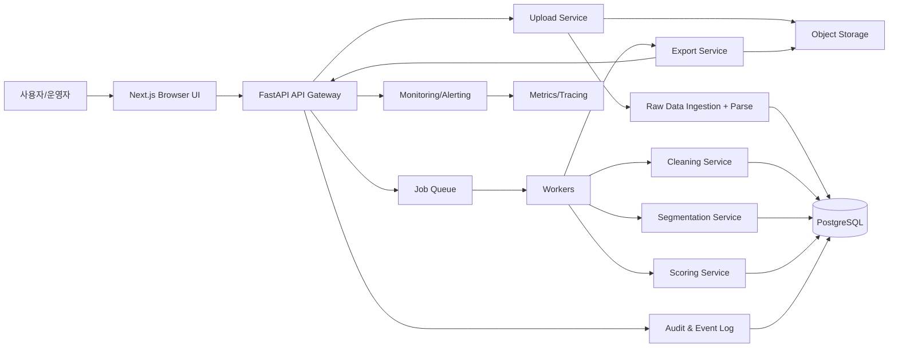

# Minerva Architecture (v1)

## 0. 한 줄 설계 목표
`Minerva`는 포트폴리오 B2B Account 데이터를 안정적으로 수집·정제·세분화·점수화하고, 포트폴리오 회사별 니즈에 맞춰 Export까지 자동화하는 플랫폼이다.

## 1. 시스템 경계
- Web UI (Next.js)
- API/서비스 (FastAPI)
- 배치/작업 큐 (Redis + RQ)
- DB (PostgreSQL)
- Object Storage (S3/MinIO)
- 인증/권한 (OAuth/JWT + RBAC)

## 2. 논리 아키텍처

## 3. 데이터 파이프라인
- Stage 0 (Ingest)
  - Upload API는 원본 파일을 저장소(S3)에 저장 후 `import_batch` 레코드 생성
  - 파일 메타: 포맷, 라인 수, 해시, 업로더, 대상 포트폴리오
- Stage 1 (Parse/Normalize)
  - XLSX/CSV를 canonical row 형태로 변환
  - 컬럼 자동 추론 + 사용자 매핑 템플릿 적용
- Stage 2 (Validation)
  - 필수값 검증, 타입 검증, 범주 검증, 정규식 검증
  - 실패 항목은 reject reason과 함께 사용자에게 리포트
- Stage 3 (Cleaning)
  - 쓰레기 데이터 제거/보정 규칙 적용
  - 중복 탐지(Exact+유사도), 충돌 처리(Overwrite / Keep Latest / Skip)
- Stage 4 (Enrichment & Segment)
  - 회사명 정규화, 도메인 추출, 주소 정규화
  - Segment Rule 적용 + 근거 로그 저장
- Stage 5 (Scoring)
  - 규칙 가중치 기반 score 계산 + explainability 저장
  - 상위 후보를 우선순위 큐에 반영
- Stage 6 (Export)
  - 포트폴리오별 템플릿 매핑으로 필터링/정렬/포맷팅
  - 생성 파일, 파라미터, hash, 사용자 저장

## 4. 핵심 컴포넌트 책임
- API Gateway
  - 인증, 권한, 요청 검증, 트랜잭션 시작/완료/오류 핸들링
- Ingestion Service
  - 파일 업로드, 파싱, 배치 생성
- Cleaning Service
  - 규칙 엔진, 클렌징 룰 버전 관리
- Segmentation Service
  - 규칙 기반 우선, 추후 ML 모델 인터페이스 추가
- Scoring Service
  - 수치형 스코어와 카테고리 `hot/warm/cold` 산출
- Export Service
  - 템플릿 렌더링/포맷 변환/다운로드 URL 발급
- Audit Service
  - 이벤트 카프카 대체: RDB 기반 event log + periodic purge 정책

## 5. 이벤트/오류 처리
- 동시성 제어: 업로드 배치 단위 락 + idempotent job key
- 실패 정책: 재시도 3회 + DLQ(Dead Letter 큐)
- 상태 모델: `PENDING/RUNNING/VALIDATING/CLEANING/SCORING/EXPORT/DONE/FAILED`
- 트랜잭션 경계: `account_raw` insert + `import_batch` 상태 전환은 하나의 원자성 단위에 가깝게 설계

## 6. 보안/권한
- 테넌트/회사 단위 격리: `portfolio_company_id` 기반 row-level access policy
- 감사: 모든 수정·삭제·Export은 actor + timestamp + reason으로 로그
- 비밀번호/토큰/비밀값은 환경변수 or Vault
- 업로드 파일에 대한 멀웨어/스캔(운영 단계에서 도입)

## 7. 성능/스케일
- 대량 업로드 시 row chunking 파이프라인(예: 5k~20k rows per chunk)
- 정합성 검증은 동기 미리보기 + 비동기 full validate 분리
- Postgres 인덱스 우선순위
  - `(portfolio_company_id, domain)`
  - `(segment_id, score_bucket)`
  - `(account_clean_status, created_at)`
- 캐시: 자주 쓰는 세그먼트/필터 옵션은 Redis 캐시

## 8. 배포 아키텍처(초기)
- 추천: Docker Compose (개발), AWS ECS/Fargate 또는 Kubernetes(운영)
- 서비스 분리
  - web:3000
  - api:8000
  - worker:8001
  - postgres:5432
  - redis:6379
  - object storage
- 단일 리포로 시작해 모듈 단위 분리

## 9. CI/CD 및 테스트 전략
- Pipeline
  - lint + unit test + schema test + build
  - migrations test (임시 DB에서 forward/backward check)
- 문서-코드 동기화
  - architecture 변경시 `architecture.md` 업데이트를 PR 체크리스트 의무항목으로
- 배포 전점검
  - 샘플 업로드 3종: 정상, 누락컬럼, 중복 데이터
  - export 테스트 2종: CSV/Excel

## 10. 단계적 확장
- v1: 규칙 기반
- v2: ML 모델 기반 세그먼트 분류/스코어링 보정
- v3: 계정 활동 로그(이메일/콜/미팅) 결합형 예측 점수
- v4: RAG 기반 고객 리포트 자동 요약
